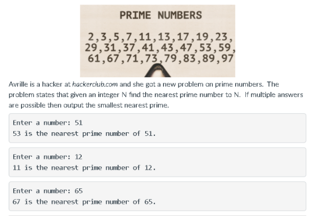

# Prime-Number



### Java
``` Java
import java.util.Scanner;
public class primenumber {


    public static void main(String[] args) {
        Scanner scanner = new Scanner(System.in);
        System.out.print("Enter a number: ");
        int num = scanner.nextInt();
        boolean x;
        int y = 0;
        int z = 0;
        int i,j,k;


        for(j = 2; j <= num; j++){
            x = false;
            for (i = 2; i < j; i++) {
                if (j % i == 0) {
                    x = true;   
                    break;
                }
            }
        
            if(!x){
                y = i;
            }
        }

        
        int newNum = num;
        while(true){
            newNum++;
            x = false;
            for (k = 2; k < newNum; k++) {
                if (newNum % k == 0) {
                    x = true;   
                    break;
                }
            }
        
            if(!x){
                z = k;
                break;
            }
        }


        if((num - y) <= (z - num)){
            System.out.println(y + " is the nearest prime number of " + num);
        }
        else{
            System.out.println(z + " is the nearest prime number of " + num);
        }

    }
   }
 
```

### Python
``` Python
num = int(input("Input a number: "))
for i in range(2, num+1):
    for j in range(2, i):
        if i % j == 0:
            break
    else:
        x = i

newNum = num
while True:
    newNum += 1
    for k in range(2, newNum):
        if newNum % k == 0:
            break
    else:
        y = newNum
        break


if (num - x) <= (y - num):
    print(f"{x} is the nearest prime number of {num}.")
else:
    print(f"{y} is the nearest prime number of {num}.")

```